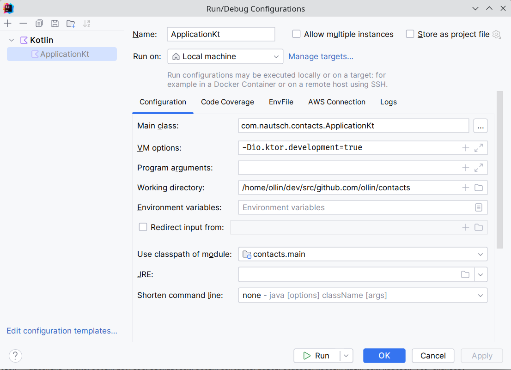

= Contacts

Example project based on the htmx book at https://hypermedia.systems/

This example is using the following technologies:

* kotlin
* kotlin html dsl
* htmx
* alpine js
* tailwind css
* ktor (web server)

* gradle (build tool) with kotlin dsl
** node, npm, npx are integrated into the gradle build

== Build

Install all dependencies and build:

[source,bash]
----
./gradlew build
----

=== Continuous build

During development, you want to edit a file while running the project and see the
changes immediately. This is possible with the continuous build:

[source,bash]
----
./gradlew build -t
----

At the same time, you can run the server in development mode. I use the run configuration in IntelliJ IDEA.

As you can imagine there are more possible options to run the server in link:https://ktor.io/docs/development-mode.html[development mode].
